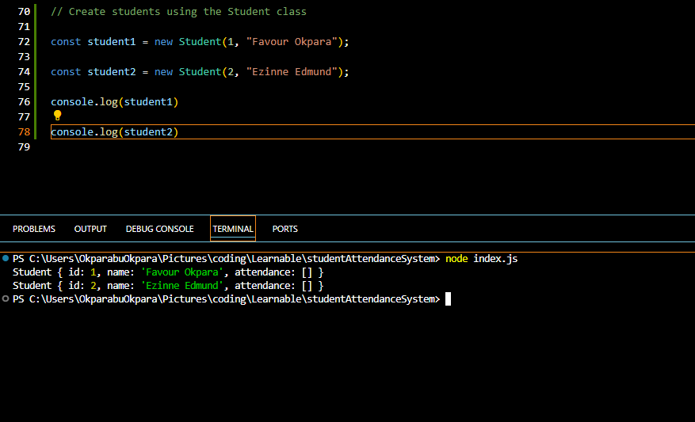
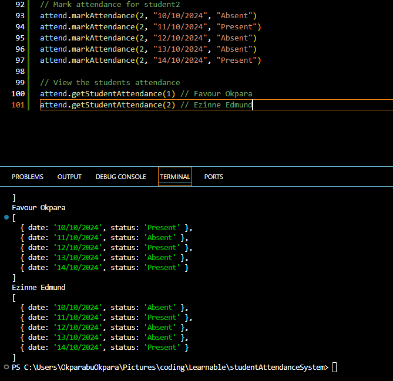

# Students Attendance System

---

## Table of Contents

1. [Problem Domain Description](#problem-domain-description)
2. [Class Diagram](#class-diagram)
3. [Code Implementation](#code-implementation)
4. [Code Execution output](#code-execution-output)

---

## Problem Domain Description

**Title** : Students Attendance System

**Description** : The Student Attendance System is designed to efficiently manage and track the attendance of students. It comprises of two main classes: Student, which represents individual students with unique IDs, names, and attendance records; and AttendanceSystem, which manages a collection of students and their attendance data. This system allows for adding students, marking their attendance, and retrieving attendance records. Additionally, it includes static attributes and methods to maintain overall student count and system version information.

---

## Class Diagram

[Click this statement to view IN LUCID CHART a UML class diagram showing the above Students Attendance System](https://lucid.app/lucidchart/554ccfad-db86-4b76-8630-74a91ea89596/edit?view_items=gpPJDqJcj678&invitationId=inv_96219b0c-ecb8-4435-bd66-f74b06de7813)

Below is an IMAGE of what the above UML class diagram looks like


---

## Code Implementation

The source code file for the Students Attendance System is located in the index.js file of this repo.

### **Set Up Steps**

1. Clone this repo

   ```bash
   git clone https://github.com/Okpara202/student-attendance-system-uml-.git
   ```

2. Navigate to index.js and there you will see the source code

3. Run the source code on your terminal

   ```bash
   node index.js
   ```

4. You can also run on it on your browser console

---

## Code Execution Output

1. **Creating instances of students from the Student class**

   

2. **Adding / Linking the students to the Students Attendance System**

   

3. **Mark attendance for the students**

   

4. **View Student's attendance**

   

5. **Scenario for when the student doesnt exist in our database**

   

If you would like to see more code execution outputs, navigate to the img file in this repo.

<div style="text-align: center;">

### **THANK YOU**

</div>
